# GRETA — Architecture (Fase 3)

> **Fecha**: 2026-05-10
> **Autor**: Claude Code (sesión interactiva, fase 3 del documento maestro)
> **Inputs**: `master.md`, `context-greta.md`, `outputs/GRETA-research.md`, `outputs/GRETA-discovery.md`.
> **Objetivo**: definir CÓMO se construye el SaaS — ADRs, diagrama, schemas, pipelines, seguridad, devops. Decisiones tomadas, no opciones abiertas.

---

## 0. Resolución previa de las 9 preguntas abiertas del Discovery

| # | Pregunta | Decisión | Justificación corta |
|---|---|---|---|
| 1 | Multi-database por tenant en un solo proyecto Firebase, o un proyecto GCP por tenant | **Multi-database en un solo proyecto Firebase**, con pool de proyectos cuando se llegue a ~80 instancias activas | Quota documentada de Firestore es 100 databases nombradas por proyecto. Operación más simple para el sweet spot; escalado horizontal con pool de proyectos cuando aplique |
| 2 | Cifrado envelope server-side trusted vs zero-knowledge | **Server-side en Cloud Function trusted** | Zero-knowledge rompe recovery (líder pierde llave → datos perdidos), UX inaceptable B2C/B2B SaaS. Se mitiga con auditoría exhaustiva + CMEK del cliente opcional para Enterprise |
| 3 | Vertex AI Vector Search vs Firestore Vector Search | **Firestore Vector Search** (GA desde 2025) | Una pieza menos, mismo billing/IAM, suficiente para volúmenes esperados (<100K vectores/instancia). Migración a Vertex Vector Search documentada como plan B |
| 4 | Cloud Run vs Cloud Functions Gen 2 | **Cloud Functions Gen 2 por defecto** (corre sobre Cloud Run), **Cloud Run dedicado** sólo para servicios de larga duración (export GDPR, batch nightly) | Funcs Gen 2 simplifica deploy y observabilidad. CR dedicado cuando se necesite control fino de concurrencia o WebSockets |
| 5 | pgvector en Cloud SQL como alternativa | **NO** — mantener Firestore para todo el stack | Consistency con resto de decisiones; evita dual database (operación + costes); pgvector es excelente pero el coste operativo de añadir Postgres no compensa en este perfil |
| 6 | Rotación de claves KMS | **Rotación automática anual** de KEKs; DEKs existentes intactas; re-encrypt-on-write con KEK nueva | Best practice GCP KMS; minimiza operaciones de re-cifrado masivo; auditoría confirma rotación efectiva |
| 7 | Stripe webhooks vs polling | **Webhooks con idempotency key** + Cloud Function dedicada | Real-time, eficiente, estándar Stripe; idempotency previene side-effects duplicados |
| 8 | Service worker strategy (PWA) | **Mixto por ruta**: shell estático cache-first; API datos network-first con cache fallback; imágenes stale-while-revalidate | Workbox config estándar; balance latencia/freshness por tipo de recurso |
| 9 | E2E testing del flujo IA | **Mock del LLM en CI** con responses fixture (Vitest + msw); **sandbox real Vertex AI** semanal con presupuesto limitado en GitHub Actions | CI rápido y barato (mocks); sandbox real detecta drift del modelo / cambios API |

---

## 1. ADRs (Architecture Decision Records)

> Formato condensado: contexto, decisión, consecuencias. Los ADRs maduros pueden expandirse a documentos individuales en `/docs/adr/` cuando arranque desarrollo.

### ADR-001 — Stack principal del SaaS

**Contexto**: Construir GRETA como SaaS multi-tenant con instancias por líder, EU GDPR, IA con RAG privada, web + móvil futuro, presupuesto cloud sostenible para 1–500 instancias.

**Decisión**:
- **Frontend**: Astro 5 + Lit 3 + JavaScript vanilla con JSDoc/.d.ts; CSS vanilla con custom properties; estado con Signals + Firebase `onSnapshot`; UI sobre catálogo `@manufosela/*`.
- **Backend**: Firebase ecosystem en GCP — Cloud Functions Gen 2 + Cloud Run (servicios largos) + Firestore + Cloud Storage + Cloud KMS + Vertex AI.
- **Auth**: Google Identity Platform (GCIP) con multi-tenancy (un tenant GCIP por instancia GRETA).
- **IA**: Claude Sonnet 4.6 vía Vertex AI `europe-west1` para análisis cualitativo; Claude Haiku 4.5 vía Vertex AI para CV parsing + tareas económicas; embeddings con `text-embedding-005` de Vertex.
- **Vector store**: Firestore Vector Search (namespace por instancia).
- **Pagos**: Stripe.
- **CI/CD**: GitHub Actions → deploy a staging y promoción manual a prod.
- **Hosting frontend**: Firebase Hosting (CDN + SSL gratis); fallback a Cloud Run si Astro requiere SSR específico.

**Consecuencias**:
- Vendor lock-in alto con Firebase. Mitigado con DAL abstracto (interfaces de repositorio) — coste de salida ~6 meses.
- Onboarding rápido por familiaridad del autor con el stack Firebase.
- Coste predecible para 1–100 instancias; revisable para 100+.

### ADR-002 — Multi-tenancy: aislamiento por database Firestore + tenant GCIP

**Contexto**: cada líder tiene una instancia privada con datos completamente aislados. El research descartó opciones single-DB-shared con RLS por debilidad de aislamiento.

**Decisión**:
- **Un tenant GCIP por instancia** — silos de auth con configuración independiente.
- **Una database Firestore nombrada por instancia** — `instance-<uid>`. Por defecto soporta hasta 100 databases por proyecto.
- **Un namespace en Firestore Vector Search por instancia** = `<instance_uid>`.
- **Un keyring Cloud KMS por instancia** + clave maestra `instance-<uid>-master`.
- **Un bucket Cloud Storage por instancia** = `gs://greta-instance-<uid>` con CMEK aplicado.
- **Pool de proyectos GCP** cuando una instancia dada no quepa por quota (>80 databases activas en un proyecto, plan B): orquestador `instance-allocator` decide en qué proyecto provisionar.

**Consecuencias**:
- Aislamiento físico fuerte (no compartido en colecciones).
- Coste de provisioning por nuevo signup ≈ 5 segundos de Cloud Function + recursos creados.
- Quota de 100 databases por proyecto limita escala — gestión con pool desde signup #80.
- Tests automatizados de aislamiento cross-tenant en CI obligatorios.

### ADR-003 — Base de datos principal y estrategia de grafo

**Contexto**: Discovery confirma que el grafo nativo no es necesario para MVP/Beta; las queries del producto son resolubles con Firestore + junction collections.

**Decisión**:
- **Firestore Native mode** como BBDD principal, una database por instancia.
- **Junction collections** para relaciones M:N (`memberships`, `contributions`, `validations`).
- **Índices compuestos** explícitos para las queries críticas (listadas en §5).
- **Sin grafo nativo en MVP/Beta**. Si la "Vista de grafo" o queries multi-hop se vuelven dominantes en producción, **migración asistida a Neo4j Aura Professional** ($65/mes/instancia) sólo para el subgrafo necesario, manteniendo Firestore como source of truth.

**Consecuencias**:
- Sin coste extra de grafo en MVP/Beta.
- Modelado require disciplina (junction patterns, índices compuestos) — documentar.
- Migración futura a Neo4j Aura mantiene Firestore como SoT — trabajo localizado al servicio de grafo.

### ADR-004 — Cifrado y gestión de claves

**Contexto**: Datos GRETA caen potencialmente en Art. 9 GDPR (assessments emocionales, transcripciones). Requiere defense-in-depth.

**Decisión**:
- **CMEK a nivel database** Firestore + Storage por instancia (key del cliente vía Cloud KMS).
- **Envelope encryption a nivel campo** para "muy sensibles" (transcripciones, razonamientos IA dim emocional, ConsentRecords): DEK generado con KMS por instancia, AES-256-GCM en cliente trusted (Cloud Function), DEK envuelto persistido junto al ciphertext.
- **Cifrado server-side trusted** (no zero-knowledge): la Cloud Function tiene IAM para usar la KMS key y descifrar al servir lecturas. Razón: recovery si el líder pierde acceso. Auditoría exhaustiva en cada `decrypt`.
- **Rotación KEKs anual** automática vía KMS rotation policy. DEKs existentes válidas; re-encrypt en próxima escritura.
- **TLS 1.3** obligatorio en tránsito + HSTS + cert pinning en mobile (Capacitor Beta).

**Consecuencias**:
- Cumple GDPR Art. 32 (security of processing).
- Coste KMS marginal: $0.06/M operations + $0.06/key/mes.
- Latencia añadida ~5–15ms por descifrado (despreciable vs LLM call).
- Si Google sufre breach del bucket Firestore o Storage, datos cifrados con envelope no son legibles sin KMS access.

### ADR-005 — Capa RAG: Firestore Vector Search + Vertex AI

**Contexto**: necesidad de RAG privado por instancia, EU residency, presupuesto razonable.

**Decisión**:
- **Vector store**: Firestore Vector Search (GA 2025). Cada instancia tiene su database; sus vectores viven en colecciones `embeddings/{personId}/{chunkId}` con índice vectorial sobre el campo `vector`.
- **Embedding model**: `text-embedding-005` de Vertex AI (EU regional endpoint), 768 dim.
- **LLM análisis cualitativo**: Claude Sonnet 4.6 vía Vertex AI `europe-west1`.
- **LLM CV parsing y tareas económicas**: Claude Haiku 4.5 vía Vertex AI `europe-west1`.
- **Chunking**: ~800 tokens, overlap 100, con splitter semántico (LangChain o equivalente JS).
- **Aislamiento**: cada query Vector Search es contra la database de la instancia; metadata adicional `person_id` para filtrar dentro de la instancia.
- **Caching**: respuestas LLM no se cachean (cada conversación es única); embeddings sí (deduplicación por hash del chunk).

**Consecuencias**:
- Una sola pieza para BBDD + vectores → simplicidad operacional.
- Aislamiento garantizado por design (database por instancia).
- Coste estimado por conversación (5K palabras): ~$0.054 (Research §3.2).

### ADR-006 — Autenticación y autorización

**Contexto**: líder es único usuario con cuenta; observadores tienen acceso temporal vía link/magic-link; admin SaaS separado.

**Decisión**:
- **Auth líder**: GCIP con multi-tenancy. Email+password + Google OAuth + Microsoft OAuth (futuro).
- **Tokens**: ID tokens JWT firmados por GCIP, validación server-side en cada request (Cloud Functions).
- **Vistas compartidas (MVP)**: JWT firmado por backend con clave dedicada, claims `view_id`, `instance_id`, `expiry`, `nonce`. Validación en Cloud Function que sirve la vista.
- **Magic-link (Beta)**: Firebase Auth email link sign-in en tenant GCIP separado `tenant-observers`. Permisos limitados al `view_id`.
- **Admin SaaS**: cuenta GCIP en tenant separado `tenant-saas-admin` con roles IAM dedicados. Acceso a datos de instancia denegado por defecto, requiere "break-glass" procedure con audit notification.
- **Authorization**: Firestore Security Rules + Cloud Function checks. Ningún cliente accede directamente a Firestore — siempre via Functions/Hosting (excepto onSnapshot autenticados con tokens).

**Consecuencias**:
- Modelo simple para MVP (sólo líder).
- Magic-link Beta requiere setup adicional pero es estándar GCIP.
- Break-glass del admin queda en audit log + email automático al líder afectado.

### ADR-007 — Compartición de vistas read-only

**Contexto**: requisito explícito del documento maestro; observadores externos sin app completa.

**Decisión**:
- **MVP**: link firmado JWT generado server-side. URL: `https://app.greta.io/v/<jwt>`. Validación en Cloud Function `serveSharedView` — verifica firma, expiry, blacklist. Rendering server-side de un subset estático de la app (Astro puede SSR esta ruta concreta).
- **Datos servidos**: SOLO lo configurado en `ShareableView.content_config`. Nunca contenido textual sensible (transcripciones completas, razonamientos detallados de dim emocional). Sólo agregados y visualizaciones.
- **Revocación**: blacklist (set de `jwt_jti` revocados) en Firestore con TTL = expiry máximo. Verificada en cada serve.
- **Beta**: añadir magic-link como alternativa configurable; auth identifica al observador antes de servir.

**Consecuencias**:
- Endpoint público (firmado) requiere atención extra a security: rate limiting, captcha si abuso, monitorización.
- Preview obligatoria mitiga errores del líder.

### ADR-008 — Estrategia web + móvil

**Contexto**: producto debe funcionar en web (uso primario, dashboard) y eventualmente en móvil. Discovery confirma móvil NO crítico para MVP.

**Decisión**:
- **MVP/Beta**: PWA pura — Astro + Lit + Workbox.
- **Distribución móvil (post-MVP)**: Capacitor 7+ envuelve la PWA en app iOS/Android; plugins nativos a demanda (push, biometría, share).
- **No reescritura a RN/Flutter** salvo que dogfooding post-Beta muestre limitaciones críticas (push iOS robusto, offline avanzado, performance crítico).

**Consecuencias**:
- Una sola codebase para web + móvil.
- Limitaciones conocidas de PWA en iOS (push) aceptadas para MVP.
- Migración a Capacitor es 1 sprint adicional sin rehacer código.

### ADR-009 — Pipeline de procesamiento de CV y documentos

**Contexto**: necesidad de extraer información estructurada de CVs (PDF/DOCX) en español; alternativas evaluadas en Research.

**Decisión**:
- **No usar Affinda/Sovren**. Usar **LLM directo** (Claude Haiku 4.5 vía Vertex AI EU).
- **Pipeline**:
  1. Líder sube PDF/DOCX (cifrado en cliente con envelope).
  2. Cloud Function `processCV` triggerada por evento Storage.
  3. Descifra → extrae texto (`pdf-parse` para PDF, `mammoth` para DOCX).
  4. Llama Claude Haiku con system prompt + JSON Schema (Valibot o Zod schema serialized).
  5. Output: JSON estructurado validado.
  6. Genera embeddings de párrafos relevantes (logros, proyectos) → Firestore Vector.
  7. Crea `DocumentExtraction` + `AiSuggestion`.
- **Fallback**: si la calidad de Haiku resulta insuficiente en producción (<90% precisión en pruebas con corpus real), fallback a Sonnet o reactivar opción Affinda.

**Consecuencias**:
- Coste ~25× menor vs Affinda ($0.005 vs $0.13 por CV).
- Calidad por validar con corpus real en Sprint 0.
- Salida JSON personalizable a las necesidades GRETA.

### ADR-010 — Provisioning automático de instancias

**Contexto**: requisito de Discovery — instancia creada en <5s al signup, atómico, idempotente.

**Decisión**:
- **Cloud Function `signupLeader`** orquesta provisioning sequencial:
  1. Crea cuenta GCIP en tenant correcto.
  2. Llama `instance-allocator` para decidir proyecto Firebase destino.
  3. Crea KMS keyring + key.
  4. Crea Firestore database con CMEK.
  5. Crea Storage bucket con CMEK.
  6. Configura Firestore Vector Search index.
  7. Crea documento `Instance` con metadata.
  8. Envía email bienvenida.
- **Atomicidad**: si cualquier paso falla, ejecuta rollback inverso. Marker `provisioning_state` en Firestore para retry idempotente.
- **Failure recovery**: cron horario detecta instancias en estado `provisioning_pending > 1h` y reintenta o limpia.

**Consecuencias**:
- Provisioning <5s p95 si todos los servicios responden normales.
- Lógica compleja en `signupLeader` — bien encapsulada y muy testada.
- Una instancia consistente o cero residuos.

### ADR-011 — Diseño del dominio en código (DDD ligero)

**Contexto**: el código frontend (Lit + JS+JSDoc) y backend (Cloud Functions + JS) requieren disciplina para que no se mezclen capas.

**Decisión**:
- **Capa de dominio** (`/src/domain/`): tipos JSDoc / `.d.ts` puros (Person, Team, Assessment, Dimension, etc.). Sin imports de Firebase ni de Lit.
- **Capa de adapters** (`/src/adapters/`): repositorios contra Firestore. Implementan interfaces definidas en domain.
- **Capa de UI** (`/src/components/`): componentes Lit del catálogo y composiciones GRETA-específicas. Consumen los adapters mediante stores Signals o controllers Lit.
- **Capa de orchestration** (`/functions/`): Cloud Functions y Cloud Run. Orquestan adapters + LLM + KMS.

**Consecuencias**:
- Coste de salida (dejar Firebase) localizado a la capa de adapters.
- Tests unitarios de dominio sin dependencias externas.
- Tests de integración de adapters contra Firestore emulator.

### ADR-012 — Cumplimiento GDPR by design

**Contexto**: producto opera con datos de Art. 9 potencial. Discovery resuelve los flujos macro; Architecture concretiza implementación.

**Decisión**:
- **DPIA (Data Protection Impact Assessment)** redactada antes del MVP, plantilla CNIL/AEPD adaptada.
- **Records of Processing Activities (RoPA)** mantenido por DPO (designado o externo).
- **Subprocesadores documentados**: Google Cloud (con DPA), Anthropic vía Vertex (subprocesador de Google), Stripe (con DPA), SendGrid/Postmark.
- **Endpoints GDPR estándar** en la app: `/account/export`, `/account/delete`, `/people/:id/export`, `/people/:id/delete`.
- **Audit log inmutable** de operaciones GDPR (export, delete, consent recorded/revoked).
- **Política de cookies y consentimientos** en la landing antes de signup.

**Consecuencias**:
- Compliance demostrable ante autoridades.
- Procedimientos documentados; coste operativo del DPO.

---

### ADR-013 — Pipeline dual de IA: assessments + guardarraíles (RC3)

**Contexto**: RC3 §13 define 9 guardarraíles que deben evaluar entradas del usuario (outcomes, contribuciones, evidencias, vistas compartidas, etc.) sin bloquear nunca. Esto multiplica las llamadas a LLM por instancia. Hay 3 ejes de decisión: (1) inline mientras se escribe vs onSave; (2) un único system prompt genérico vs prompts especializados; (3) modelo único vs modelo barato (Haiku) para guardarraíles.

**Opciones consideradas**:
- A. Pipeline único con todos los guardarraíles en cada llamada (1 LLM call por entidad guardada). Simple, caro y lento.
- B. Pipelines independientes, evaluación **onSave asincrónica** con Haiku 4.5 para clasificación + reformulación, Sonnet 4.6 solo para guardarraíl 4 (transcripción) y assessments. Lógica determinista para 5/7/8.
- C. Cliente edge-side con modelo embebido (`@xenova/transformers`) para feedback inline + LLM solo en casos ambiguos.

**Decisión**: **B**. Onsave asincrónico, modelo barato para 7 de 9 guardarraíles, determinista para los 3 que son puramente reglas (sesgo de atención, base observacional, bajadas de nivel).

**Justificación**:
- Coste: Haiku 4.5 es ~3× más barato que Sonnet. El 80% de los guardarraíles son clasificación + reformulación corta — Haiku basta. Coste adicional total: ~$3-6/instancia/mes (Crecimiento). Marginal.
- UX: la evaluación inline mientras se escribe interrumpe el flujo y obliga a hacer N llamadas por keystroke. OnSave asincrónico con toast `<inline-banner>` cumple el principio RC3 "avisar sin bloquear" sin penalizar la escritura.
- Honestidad: la IA debe evaluar el texto final, no fragmentos. Onsave es el momento natural.
- Determinismo donde posible: el guardarraíl 8 (sesgo de atención) es un query Firestore con umbral temporal. El 7 (bajadas de nivel) es comparación numérica. El 5 (base observacional) es conteo. Para los 3 se usa lógica determinista; la narrativa del mensaje se genera con Haiku **solo cuando se dispara**.

**Implementación**:
- 9 Cloud Functions independientes (`evalGuardrail1Outcome`, ..., `evalGuardrail9MapInterpretation`), cada una invocada por trigger Firestore onCreate/onUpdate o por cron (8).
- System prompts diferenciados por guardarraíl (ver §4.7).
- Cada Cloud Function escribe `GuardrailWarning` en Firestore. El frontend escucha vía `onSnapshot` y muestra `<guardrail-warning-card>` o `<inline-banner>`.
- Reintentos: si el LLM call falla, la function publica el evento a Pub/Sub topic `guardrail-retry`; cron diario procesa el backlog.

**Consecuencias**:
- Coste adicional contenido y predecible.
- Latencia desacoplada: el guardado del documento es síncrono y rápido; la warning aparece después (UX similar a "spell-check" de Google Docs).
- 9 functions a mantener, pero cada una <50 líneas de código (solo orquestación + parseo Valibot).
- Si Vertex AI Haiku tiene downtime, los guardarraíles fallan abierto: el documento sigue guardado, la warning se intenta luego. Aceptable porque no bloquean.

---

### ADR-014 — Modelo de impacto: Challenge / Outcome / EarlySignal / Contribution / Experiment (RC3 §12)

**Contexto**: RC3 §12 introduce una capa de impacto sobre las 4 dimensiones. Las 7 decisiones de modelado se tomaron en Discovery. Architecture concretiza estructura, índices y patrones de acceso.

**Opciones consideradas**:
- A. Todo como subcolecciones de `Team` (jerarquía estricta).
- B. Top-level collections con FKs explícitos (planar).
- C. Híbrido: Outcome/Challenge/Experiment a nivel team (subcollection), Contribution/Evidence a nivel person (subcollection), GuardrailWarning como collection polimórfica top-level.

**Decisión**: **C**. Encaja con los patrones de acceso reales: el dashboard de equipo necesita lecturas eficientes sobre todos los outcomes del equipo; la ficha de persona necesita lecturas eficientes sobre todas sus contribuciones/evidencias; las warnings se filtran por entity_type + entity_id y se consultan también globalmente ("ver todas las warnings de mi instancia").

**Estructura Firestore**:
- `/instances/{instanceId}/teams/{teamId}/challenges/{challengeId}` — un activo a la vez (campo `is_current`)
- `/instances/{instanceId}/teams/{teamId}/outcomes/{outcomeId}` — 3-5 por equipo
- `/instances/{instanceId}/teams/{teamId}/outcomes/{outcomeId}/early_signals/{signalId}` — 1-2 por outcome (subcollection)
- `/instances/{instanceId}/teams/{teamId}/experiments/{experimentId}` — colección de team
- `/instances/{instanceId}/people/{personId}/contributions/{contributionId}` — 1-3 por persona
- `/instances/{instanceId}/people/{personId}/evidences/{evidenceId}` — alta cardinalidad
- `/instances/{instanceId}/teams/{teamId}/gaps/{gapId}` + `/instances/{instanceId}/teams/{teamId}/interventions/{interventionId}`
- `/instances/{instanceId}/guardrail_warnings/{warningId}` — top-level polimórfica con `entity_type` + `entity_id`

**Justificación**:
- Tres lecturas dominantes: (a) dashboard de equipo → leer outcomes + early_signals + experiments de un team; (b) ficha persona → leer contributions + evidences de una person; (c) panel de warnings → consulta top-level con filtros.
- Reglas de seguridad Firestore más simples (cada subcollection hereda del padre).
- Las evidencias pueden vincular múltiples contributions y outcomes: campos `contribution_ids[]` y `outcome_ids[]` arrays + collectionGroup query para "evidencias que tocan outcome X".

**Consecuencias**:
- Schemas detallados en §3.1 (añadidos en el RC3 patch).
- Índices compuestos nuevos: `evidences` por `(observed_at desc)`, `guardrail_warnings` por `(entity_type, ignored, created_at desc)`, `experiments` por `(status, ended_at)`.
- Migración (cuando exista data): script de seed para Challenge/Outcome iniciales por equipo.

---

## 2. Diagrama de arquitectura (Mermaid)

```mermaid
flowchart TB
  subgraph Browser["🖥️ Browser / PWA / Mobile (Capacitor Beta)"]
    Astro["Astro 5 + Lit 3<br/>JS vanilla + JSDoc<br/>Catálogo @manufosela/*<br/>Workbox SW"]
  end

  subgraph FirebaseHosting["Firebase Hosting + CDN"]
    Static["HTML/CSS/JS shell<br/>cache-first SW"]
  end

  subgraph GCPProject["GCP Project — greta-prod (pool si >80 instancias)"]
    subgraph Auth["GCIP — Multi-tenant"]
      TenantLeaders["tenant-leaders<br/>(1 sub-tenant por instancia)"]
      TenantObservers["tenant-observers<br/>(magic-link Beta)"]
      TenantAdmin["tenant-saas-admin"]
    end

    subgraph Functions["Cloud Functions Gen 2 + Cloud Run"]
      F_Signup["signupLeader<br/>provisioning atómico"]
      F_ProcessCV["processCV<br/>extracción + IA"]
      F_ProcessConv["processConversation<br/>RAG + Sonnet"]
      F_ServeView["serveSharedView<br/>JWT validation"]
      F_Stripe["stripeWebhook<br/>idempotent"]
      F_GDPR["gdprDelete / gdprExport<br/>cascada"]
      CR_Export["Cloud Run: gdpr-exporter<br/>(jobs largos)"]
    end

    subgraph Data["Firestore (multi-database)"]
      DB1[("instance-uid1<br/>+ vector index")]
      DB2[("instance-uid2<br/>+ vector index")]
      DBN[("instance-uidN")]
    end

    subgraph Storage["Cloud Storage (bucket por instancia, CMEK)"]
      S1["greta-instance-uid1"]
      S2["greta-instance-uid2"]
      SN["greta-instance-uidN"]
      Backups["greta-backups (snapshots diarios)"]
    end

    subgraph KMS["Cloud KMS"]
      KR1["keyring instance-uid1<br/>master + DEK wraps"]
      KR2["keyring instance-uid2"]
      KRN["keyring instance-uidN"]
    end

    subgraph Vertex["Vertex AI europe-west1"]
      Sonnet["Claude Sonnet 4.6"]
      Haiku["Claude Haiku 4.5"]
      Embed["text-embedding-005"]
    end

    AuditLogs["Cloud Audit Logs<br/>(inmutable, 7 años)"]
    Monitoring["Cloud Monitoring + Alerting"]
  end

  subgraph External["Servicios externos"]
    Stripe["Stripe<br/>suscripciones"]
    Email["SendGrid / Postmark<br/>emails transaccionales"]
  end

  Browser -->|HTTPS / TLS 1.3| Static
  Browser -->|onSnapshot autenticado| DB1
  Browser -->|callable functions| Functions
  Browser -->|signed URL upload| Storage

  F_Signup --> Auth
  F_Signup --> KMS
  F_Signup --> Data
  F_Signup --> Storage

  F_ProcessCV --> Storage
  F_ProcessCV --> KMS
  F_ProcessCV --> Vertex
  F_ProcessCV --> Data

  F_ProcessConv --> Storage
  F_ProcessConv --> KMS
  F_ProcessConv --> Vertex
  F_ProcessConv --> Data

  F_ServeView --> Data
  F_ServeView --> KMS
  F_Stripe --> Stripe
  F_GDPR --> Data
  F_GDPR --> Storage
  F_GDPR --> KMS
  F_GDPR --> CR_Export

  Functions --> AuditLogs
  Functions --> Email

  Stripe -.webhook.-> F_Stripe

  Data --> Backups

  classDef sensitive fill:#fff3cd,stroke:#664d03;
  class DB1,DB2,DBN,S1,S2,SN sensitive;
```



### 2.1 Flujo de petición tipo (procesar transcripción O2O)

```
[Browser] → [Firebase Hosting CDN] → load shell
[Browser] cifra archivo (envelope con DEK del KMS de la instancia) → uploads a Storage signed URL
[Browser] llama callable Function `processConversation(documentId)`
  ↓
[F_ProcessConv]
  - Verify auth: request.auth.uid == instance.owner_uid
  - Read Document metadata from Firestore DB de la instancia
  - Pull ciphertext from Storage
  - Call KMS decrypt (envelope) → plaintext en memoria
  - Chunk text (~800 tokens)
  - Call Vertex AI Embeddings → vectores 768-dim
  - Write embeddings to Firestore Vector Search collection con metadata (person_id, doc_id, chunk_idx)
  - Build RAG context: GRETA framework + top-k retrieval del histórico de la persona + new transcript
  - Call Vertex AI Claude Sonnet 4.6 con system prompt + JSON Schema
  - Validate output con Valibot
  - Write AiSuggestion to Firestore (status=pending)
  - Audit log de la operación
  - Return suggestion_ids
  ↓
[Browser] receives suggestion_ids → reactive UI updates (onSnapshot AiSuggestion collection)
[Líder] valida → callable Function `validateSuggestion(suggestionId, action, payload)`
  - Update AiSuggestion.status
  - Create AssessmentValidation
  - Update Person.assessments[dimension] (versionado)
  - Audit log
```

---

## 3. Modelo de datos técnico

### 3.1 Firestore — schemas

> Naming: `snake_case` para campos, `kebab-case` para IDs autogenerados (clientes pueden generar IDs propios para idempotencia). Timestamps en ISO 8601 UTC.

#### 3.1.1 Database global `default` (proyecto Firebase, no por instancia)

```jsonc
// Colección: instances (registro maestro de organizaciones / instancias)
{
  "id": "org_<nanoid>",
  "owner_uid": "uid_<leader_owner>",            // único `owner` con privilegios exclusivos (suscripción, transferencia, borrado)
  "org_name": "string",                          // nombre de la organización
  "members": ["uid_owner", "uid_co_leader_1", "uid_co_leader_2"], // todos los líderes (denormalizado para queries rápidas)
  "plan": "trial | solo | team | org | enterprise",
  "plan_expires_at": "Timestamp | null",
  "stripe_customer_id": "string | null",
  "stripe_subscription_id": "string | null",
  "firestore_db_name": "instance-<uid>",
  "firestore_project_id": "greta-prod-1 | greta-prod-2 | ...",
  "kms_keyring": "instance-<uid>",
  "kms_key_master": "instance-<uid>-master",
  "storage_bucket": "greta-instance-<uid>",
  "vector_namespace": "<uid>",
  "provisioning_state": "pending | active | failed | pending_deletion | deleted",
  "deletion_requested_at": "Timestamp | null",
  "created_at": "Timestamp",
  "updated_at": "Timestamp"
}

// Colección: leaders (perfil de cada líder, owner o co-leader)
{
  "uid": "string",
  "email": "string (unique)",
  "display_name": "string",
  "locale": "es | en",
  "timezone": "string (IANA)",
  "created_at": "Timestamp",
  "last_login_at": "Timestamp"
}

// Colección: organization_memberships (un líder puede pertenecer a varias organizaciones — owner en la suya, co-leader en la de otros)
{
  "id": "<orgId>_<uid>",
  "org_id": "string",
  "uid": "string",
  "role": "owner | co_leader",
  "permissions": {                                // granularidad opcional (Beta) para co-leaders
    "manage_subscription": false,                 // solo true para owner
    "transfer_ownership": false,                  // solo true para owner
    "delete_organization": false,                 // solo true para owner
    "manage_co_leaders": false,                   // solo true para owner
    "scope_teams": "all" | ["team_id_1", ...],   // co-leader puede tener acceso solo a ciertos equipos
    "scope_dimensions": "all" | ["knowledge", ...] // o solo a ciertas dimensiones
  },
  "invited_by": "uid",
  "invited_at": "Timestamp",
  "accepted_at": "Timestamp | null",
  "revoked_at": "Timestamp | null"
}

// Colección: shared_view_blacklist (JTI revocados)
{
  "jti": "string",
  "instance_id": "string",
  "revoked_at": "Timestamp",
  "ttl": "Timestamp"  // = original expiry; doc se borra automáticamente
}
```

**Índices globales**:
- `instances` por `owner_uid` (asc)
- `instances` por `plan` (asc) + `plan_expires_at` (asc) — para cron de upgrades/downgrades
- `instances` por `provisioning_state` (asc) — para cron de retry/cleanup
- `shared_view_blacklist` por `ttl` (asc) — TTL field configured

#### 3.1.2 Database por instancia `instance-<uid>`

```jsonc
// Colección: settings (1 doc: config de la instancia)
{
  "id": "default",
  "theme": {
    "primary": "#color",
    "secondary": "#color",
    "logo_url": "gs://path | null",
    "level_colors": {
      "tiro": "#e74c3c", "novicius": "#e67e22",
      "peritus": "#f1c40f", "expertus": "#27ae60",
      "veteranus": "#3498db", "primus": "#9b59b6", "magister": "#ecf0f1"
    }
  },
  "retention_policy": {
    "documents_months": 18,
    "assessments_years": 5,
    "rejected_suggestions_days": 90
  },
  "ai": {
    "enabled": true,
    "exclude_dimensions_for_ai": []  // ej: ["emotional"] si líder lo desactiva
  },
  "shareable_view_max_expiry_days": 90,
  "custom_fields_count_limit": 20
}

// Colección: teams
{
  "id": "team_<nanoid>",
  "name": "string",
  "area": "string | null",
  "description": "string | null",
  "status": "active | archived",
  "created_at": "Timestamp",
  "archived_at": "Timestamp | null"
}

// Colección: people
{
  "id": "person_<nanoid>",
  "name": "string",
  "email": "string | null",
  "current_role": "string | null",
  "profile_shape": "I | T | π | Comb | null",  // calculado/sugerido por IA
  "status": "active | archived | deleted",
  "created_at": "Timestamp",
  "archived_at": "Timestamp | null"
}

// Colección: memberships (junction Person-Team)
{
  "id": "<personId>_<teamId>",
  "person_id": "string",
  "team_id": "string",
  "role_in_team": "string | null",
  "start_date": "Date",
  "end_date": "Date | null",
  "is_current": "boolean"  // denormalizado para queries directas
}

// Colección: projects
{
  "id": "project_<nanoid>",
  "name": "string",
  "client": "string | null",
  "start_date": "Date",
  "end_date": "Date | null",
  "status": "active | finished | archived"
}

// Colección: contributions (junction Person-Project)
{
  "id": "<personId>_<projectId>",
  "person_id": "string",
  "project_id": "string",
  "role": "string",
  "period": "string",
  "description": "string | null"
}

// Colección: assessments
{
  "id": "assessment_<nanoid>",
  "person_id": "string",
  "dimension": "contribution_role | knowledge | seniority | emotional",
  "level": "1..7",
  "color": "tiro | novicius | peritus | expertus | veteranus | primus | magister",
  "source": "manual | ai",
  "ai_suggestion_id": "string | null",
  "justification_normal": "string",     // si dim no-emocional
  "justification_encrypted": {           // si dim emocional o líder lo marca
    "ciphertext": "base64",
    "wrapped_dek": "base64",
    "iv": "base64",
    "alg": "AES-256-GCM",
    "kms_key": "string"
  } | null,
  "tags": ["string"],
  "version": "integer",  // se incrementa con cada edición
  "is_stale": "boolean",
  "created_at": "Timestamp",
  "created_by": "uid",
  "stale_at": "Timestamp | null"
}

// Colección: documents
{
  "id": "doc_<nanoid>",
  "person_id": "string",
  "type": "cv | transcript | summary | other",
  "filename": "string",
  "storage_path": "gs://greta-instance-<uid>/documents/<id>",
  "mime_type": "string",
  "size_bytes": "integer",
  "encrypted_at_field_level": "boolean",
  "kms_key_used": "string",
  "uploaded_at": "Timestamp",
  "uploaded_by": "uid"
}

// Colección: document_extractions
{
  "id": "ext_<nanoid>",
  "document_id": "string",
  "structured_data": {
    "projects": [{...}],
    "technical_areas": [{name, level_inferred}],
    "languages": [...],
    "education": [...],
    "...": "..."
  },
  "model_used": "claude-haiku-4.5",
  "model_version": "string",
  "tokens_input": "integer",
  "tokens_output": "integer",
  "cost_usd": "number",
  "extracted_at": "Timestamp"
}

// Colección: ai_suggestions
{
  "id": "sug_<nanoid>",
  "document_id": "string | null",
  "person_id": "string",
  "dimension": "contribution_role | knowledge | seniority | emotional",
  "suggested_level": "1..7",
  "suggested_color": "string",
  "reasoning_encrypted": {  // SI dim=emotional, encrypted; ELSE plain reasoning
    "ciphertext": "base64", "wrapped_dek": "base64", "iv": "base64",
    "alg": "AES-256-GCM", "kms_key": "string"
  } | null,
  "reasoning": "string | null",
  "citations": [{"text": "string", "source_offset": "integer"}],
  "confidence": "0..1",
  "suggested_questions": ["string"],  // para próxima conversación
  "status": "pending | accepted | edited | rejected | reprocessed",
  "model_used": "claude-sonnet-4.6 | claude-haiku-4.5",
  "model_version": "string",
  "tokens_input": "integer",
  "tokens_output": "integer",
  "cost_usd": "number",
  "created_at": "Timestamp",
  "validated_at": "Timestamp | null",
  "validation_id": "string | null"
}

// Colección: assessment_validations
{
  "id": "val_<nanoid>",
  "ai_suggestion_id": "string",
  "leader_uid": "uid",
  "action": "accept | edit | reject",
  "final_level": "1..7 | null",
  "final_reasoning_encrypted": {...} | null,
  "rejection_reason": "string | null",
  "validated_at": "Timestamp"
}

// Colección: custom_fields (definiciones)
{
  "id": "cf_<nanoid>",
  "name": "string",
  "type": "short_text | long_text | number | date | single_choice | multi_choice | file",
  "options": ["string"] | null,
  "max_length": "integer | null",
  "sensitivity": "normal | sensitive | very_sensitive",
  "ai_processable": "boolean",
  "created_at": "Timestamp",
  "order": "integer"  // para UI
}

// Colección: custom_field_values
{
  "id": "cfv_<nanoid>",
  "person_id": "string",
  "custom_field_id": "string",
  "value_plain": "any | null",
  "value_encrypted": {...} | null,
  "updated_at": "Timestamp"
}

// Colección: shareable_views
{
  "id": "view_<nanoid>",
  "name": "string",
  "content_config": {
    "include_teams": ["team_id"],
    "include_people": ["person_id"] | "all",
    "include_dimensions": ["..."],
    "include_visualizations": ["radar", "evolution", "team_dashboard", "graph"],
    "include_reasoning": false  // SIEMPRE false en MVP
  },
  "expiry_at": "Timestamp",
  "jwt_jti": "string",
  "status": "active | revoked",
  "access_count": "integer",
  "last_accessed_at": "Timestamp | null",
  "created_at": "Timestamp",
  "revoked_at": "Timestamp | null"
}

// Colección: consent_records
{
  "id": "consent_<nanoid>",
  "person_id": "string",
  "consent_type": "evaluation_general | ai_processing | sharing_with_observer",
  "granted_at": "Timestamp",
  "support_text": "string | null",
  "support_storage_path_encrypted": {...} | null,  // archivo PDF firmado
  "revoked_at": "Timestamp | null",
  "expires_at": "Timestamp | null"
}

// Colección: audit_events (inmutable, append-only)
{
  "id": "audit_<nanoid>",
  "actor_type": "leader | observer | sysadmin | system",
  "actor_id": "uid | jti | system",
  "action": "decrypt | read_sensitive | update_assessment | create_share | revoke_share | gdpr_delete | gdpr_export | break_glass | ...",
  "resource_type": "document | suggestion | assessment | view | instance | person | ...",
  "resource_id": "string",
  "ip": "string",
  "user_agent": "string",
  "before": "any | null",
  "after": "any | null",
  "timestamp": "Timestamp"
}

// Colección: embeddings (vector search)
{
  "id": "emb_<nanoid>",
  "person_id": "string",
  "document_id": "string",
  "chunk_index": "integer",
  "chunk_text_hash": "string (sha256, para dedup)",
  "vector": [768 floats],  // campo indexado para vector search
  "metadata": {
    "language": "es | en",
    "type": "transcript | cv | summary | note",
    "created_at": "Timestamp"
  }
}

// ============================================
// RC3 §12 — Capa de impacto (nuevas entidades)
// ============================================

// Subcolección: teams/{teamId}/challenges
{
  "id": "chl_<nanoid>",
  "description": "string (200-500 chars)",
  "defined_at": "Timestamp",
  "retired_at": "Timestamp | null",
  "is_current": "boolean"  // único con true por team
}

// Subcolección: teams/{teamId}/outcomes
{
  "id": "out_<nanoid>",
  "challenge_id": "string (FK)",
  "title": "string",
  "description": "string",
  "status": "proposed | active | achieved | abandoned",
  "guardrail_warnings_count": "integer",  // denormalizado para badge UI
  "created_at": "Timestamp",
  "achieved_at": "Timestamp | null"
}

// Subcolección: teams/{teamId}/outcomes/{outcomeId}/early_signals
{
  "id": "sig_<nanoid>",
  "description": "string",
  "observable_metric": "string",
  "history": [
    {
      "observed_at": "Timestamp",
      "value": "number | string",
      "note": "string | null"
    }
  ],  // últimas 30 lecturas inline; resto en subcolección /readings si crece
  "trend": "rising | flat | falling | unknown",  // recomputado
  "last_observed_at": "Timestamp | null"
}

// Subcolección: people/{personId}/contributions
{
  "id": "ctr_<nanoid>",
  "team_id": "string",
  "outcome_id": "string (FK)",
  "action": "string",                  // "lidera reuniones de arquitectura..."
  "hypothesis_reason": "string",       // "porque su rol Coordinador está infrautilizado..."
  "dimension_link": "1 | 2 | 3 | 4",   // cuál dimensión GRETA justifica la hipótesis
  "status": "active | confirmed | refuted | consolidated",
  "defined_at": "Timestamp",
  "last_reviewed_at": "Timestamp"
}

// Subcolección: people/{personId}/evidences
{
  "id": "evd_<nanoid>",
  "contribution_ids": ["ctr_..."],     // multi-link
  "outcome_ids": ["out_..."],          // derivado, denormalizado
  "observation_text_encrypted": {       // envelope encryption
    "ciphertext": "...",
    "wrapped_dek": "...",
    "iv": "...",
    "alg": "AES-256-GCM"
  },
  "observed_at": "Timestamp",
  "registered_by": "uid",
  "registered_at": "Timestamp"
}

// Subcolección: teams/{teamId}/experiments
{
  "id": "exp_<nanoid>",
  "what_is_tested": "string",
  "observed_signal_id": "string (FK→early_signals)",
  "duration_days": "integer",
  "decision_criteria": "string",
  "started_at": "Timestamp",
  "ended_at": "Timestamp | null",
  "outcome_id": "string (FK)",
  "contribution_id": "string | null (FK)",  // si valida una hipótesis específica
  "status": "running | decided | abandoned",
  "result": "string | null"
}

// Subcolección: teams/{teamId}/gaps
{
  "id": "gap_<nanoid>",
  "dimension": "1 | 2 | 3 | 4",
  "description": "string",
  "severity": "low | medium | high | critical",
  "source": "auto | manual",
  "detected_at": "Timestamp",
  "resolved_at": "Timestamp | null"
}

// Subcolección: teams/{teamId}/interventions
{
  "id": "int_<nanoid>",
  "gap_id": "string (FK)",
  "palanca_tipo": "contratacion | redistribucion | formacion | acompanamiento | cambio_rol | baja",
  "value_score": "low | high",
  "risk_score": "low | high",
  "priority_decision": "act_first | act_with_experiment | monitor | defer | null",
  "notes": "string",
  "created_at": "Timestamp",
  "decided_at": "Timestamp | null"
}

// ============================================
// RC3 §13 — Guardarraíles (entidad polimórfica top-level)
// ============================================

// Colección: guardrail_warnings (top-level dentro de la instancia)
{
  "id": "gw_<nanoid>",
  "guardrail_id": "1 | 2 | 3 | 4 | 5 | 6 | 7 | 8 | 9",
  "entity_type": "Outcome | Contribution | Evidence | Document | Assessment | ShareableView | Person | Instance",
  "entity_id": "string",
  "entity_path": "string",              // path completo Firestore para deep-link
  "severity": "info | warn | critical",
  "message": "string",                  // narrativa generada por LLM o determinista
  "suggested_alternative": "string | null",
  "created_at": "Timestamp",
  "model_used": "claude-haiku-4-5 | claude-sonnet-4-6 | deterministic",
  "acknowledged_by": "uid | null",
  "acknowledged_at": "Timestamp | null",
  "ignored": "boolean",
  "ignored_reason": "string | null"
}
```

### 3.2 Índices Firestore críticos

| Colección | Campos | Tipo | Razón |
|---|---|---|---|
| `memberships` | `team_id` asc, `is_current` desc | composite | listar miembros actuales de un equipo |
| `memberships` | `person_id` asc, `is_current` desc | composite | listar equipos actuales de una persona |
| `assessments` | `person_id` asc, `dimension` asc, `created_at` desc | composite | radar chart + evolución temporal |
| `assessments` | `person_id` asc, `created_at` desc | composite | timeline general |
| `documents` | `person_id` asc, `type` asc, `uploaded_at` desc | composite | listar docs por tipo |
| `ai_suggestions` | `person_id` asc, `status` asc, `created_at` desc | composite | inbox de pendientes |
| `ai_suggestions` | `status` asc, `created_at` desc | composite | dashboard de pending global |
| `audit_events` | `actor_id` asc, `timestamp` desc | composite | auditoría por usuario |
| `audit_events` | `resource_type` asc, `resource_id` asc, `timestamp` desc | composite | timeline de un recurso |
| `embeddings` | `person_id` asc, `metadata.type` asc | composite + vector | top-k filtrado por persona |
| `shareable_views` | `status` asc, `expiry_at` asc | composite | cron de expiración |
| `outcomes` (collectionGroup) | `team_id` asc, `status` asc, `created_at` desc | composite | dashboard de impacto (RC3) |
| `contributions` (collectionGroup) | `team_id` asc, `outcome_id` asc, `status` asc | composite | listar contribuciones activas por outcome (RC3) |
| `evidences` (collectionGroup) | `observed_at` desc | single | timeline de evidencias del equipo (RC3) |
| `evidences` (collectionGroup) | `contribution_ids` array-contains, `observed_at` desc | composite | evidencias de una hipótesis (RC3) |
| `experiments` (collectionGroup) | `team_id` asc, `status` asc, `ended_at` asc | composite | cron de cierre auto + dashboard (RC3) |
| `guardrail_warnings` | `entity_type` asc, `ignored` asc, `created_at` desc | composite | panel global de warnings (RC3) |
| `guardrail_warnings` | `entity_id` asc, `ignored` asc | composite | badge UI por entidad (RC3) |

### 3.3 Firestore Security Rules (esqueleto)

```js
rules_version = '2';
service cloud.firestore {
  match /databases/{database}/documents {
    // Function helpers
    function isOrgMember() {
      // El custom claim org_ids es una lista; la database name es `instance-<orgId>`
      return request.auth != null
             && request.auth.token.org_ids.hasAny([database.replace('instance-', '')]);
    }
    function isOrgOwner() {
      return request.auth != null && request.auth.token.org_owner_of == database.replace('instance-', '');
    }
    function isSysAdmin() {
      return request.auth != null && request.auth.token.role == 'sysadmin'
             && resource.data.break_glass_authorized == true;
    }

    // Toda lectura/escritura requiere pertenencia a la organización (owner o co-leader)
    match /{document=**} {
      allow read: if isOrgMember();
      allow write: if isOrgMember() && request.resource.data.modified_by == request.auth.uid;
    }

    // Suscripción y borrado de organización: SOLO owner
    match /settings/billing {
      allow write: if isOrgOwner();
    }

    // Auditoría: append-only, sólo se pueden crear (no editar)
    match /audit_events/{eventId} {
      allow create: if request.auth != null;
      allow update, delete: if false;
    }

    // Sysadmin break-glass (raro, requiere claim especial + audit)
    match /{document=**} {
      allow read: if isSysAdmin();
    }
  }
}
```

### 3.4 Cloud Storage — estructura de bucket por instancia

```
gs://greta-instance-<uid>/
├── documents/
│   ├── <doc_id>.bin    (cifrado envelope si type ∈ {transcript, summary})
│   ├── <doc_id>.bin    (CMEK only si type == cv — menos sensible)
│   └── ...
├── consent_supports/
│   └── <consent_id>.pdf.enc
├── exports/
│   └── <request_id>.zip   (TTL 24h)
├── theme/
│   └── logo.svg
└── thumbnails/
    └── <doc_id>.png
```

CMEK aplicado a nivel bucket. Envelope encryption gestionado por Cloud Function en upload/download.

### 3.5 Firestore Vector Search — configuración

```jsonc
// Configuración del índice vector en la colección embeddings
{
  "field_path": "vector",
  "vector_config": {
    "dimension": 768,
    "flat": {}  // o "tree_ah" para escala mayor
  }
}
```

Query típica:

```js
import { Firestore, FieldValue } from "@google-cloud/firestore";

const db = new Firestore({ databaseId: `instance-${instanceUid}` });

const queryVector = await embed(transcriptionChunk);

const results = await db.collection("embeddings")
  .where("person_id", "==", personId)
  .findNearest({
    vectorField: "vector",
    queryVector,
    limit: 8,
    distanceMeasure: "COSINE",
    distanceResultField: "distance"
  })
  .get();
```

---

## 4. Arquitectura de la capa IA

### 4.1 Pipeline `processConversation` paso a paso

```
INPUT: documentId, instanceId
1. Verify auth → instance ownership
2. Read Document metadata → Firestore (instance DB)
3. Read ciphertext from Storage
4. KMS decrypt envelope:
   - decrypt wrapped_dek
   - AES-256-GCM decrypt(ciphertext, dek, iv) → plaintext
5. Text chunking:
   - splitter semántico (LangChain TextSplitter o equivalente)
   - chunks ~800 tokens con 100 tokens overlap
   - chunk_text_hash sha256 para dedup
6. Embedding:
   - Vertex AI text-embedding-005 batch call
   - 1 vector 768-dim por chunk
7. Persist embeddings to Firestore Vector Search:
   - Si chunk_text_hash existe ya → update metadata, no re-embed
8. Build RAG context:
   - System prompt: GRETA framework (~3K tokens, hardcoded)
   - Persona context: top-k=5–10 chunks del histórico de la persona
     (vectorSearch filtrado por person_id, ordered by recency + similarity)
   - User input: la transcripción nueva completa
9. Call LLM:
   - Vertex AI Claude Sonnet 4.6
   - region: europe-west1 (forzado)
   - max_tokens: 4096
   - temperature: 0.2 (consistencia)
   - response_format: JSON schema (Valibot serialized)
   - tools: opcional para citation validation
10. Parse + validate output:
    - Valibot.parse(SuggestionSchema, response)
    - Si validación falla → log + retry con prompt corrector
    - Verificar cada citation existe en el plaintext (search exact + fuzzy)
11. Persist AiSuggestion:
    - 1 doc por dimensión (4 docs típicamente)
    - status = pending
    - cost calculado: tokens × precio modelo
    - Si dimension == emotional → reasoning_encrypted
12. Audit log:
    - decrypt event, llm_call event, persist event
13. Return suggestion_ids → frontend reactiva via onSnapshot
```

### 4.2 System prompt para Claude Sonnet (esqueleto)

```
Eres un asistente experto en GRETA (Guía de Referencia de Equipos de Trabajo Afectivo),
un framework de diagnóstico de equipos de ingeniería basado en 4 dimensiones:
1. Rol de contribución (taxonomía Belbin: PL, ME, SP, CO, RI, TW, SH, IMP, CF)
2. Conocimiento (áreas técnicas + bus factor + perfil I/T/π/Comb)
3. Seniority (anticipación + resiliencia + criterio bajo incertidumbre)
4. Emocional (motivación + alineamiento + metaconsciencia)

Cada dimensión usa la escala de 7 niveles con colores: 🔴 Tiro, 🟠 Novicius, 🟡 Peritus,
🟢 Expertus, 🔵 Veteranus, 🟣 Primus, ⚪ Magister.

CONTEXTO GRETA: [framework completo, ~3K tokens]
CONTEXTO PERSONA: [chunks relevantes del histórico]
INPUT NUEVO: [transcripción de la conversación]

TAREA:
Para cada dimensión, sugiere un nivel (1-7) con color, razonamiento estructurado,
y 2-5 citas literales del INPUT NUEVO que respalden la sugerencia.
Además, sugiere 3-5 preguntas para la próxima conversación basándote en gaps detectados.

REGLAS:
- NUNCA decidas: tus sugerencias serán validadas por el líder humano.
- Cita literal: las citas deben ser texto exacto del INPUT NUEVO.
- Confidence: marca tu nivel de confianza (0.0–1.0) por sugerencia.
- Si una dimensión no tiene evidencia suficiente, devuelve confidence < 0.3 y razonamiento "evidencia insuficiente".
- En conversación nunca se habla de niveles — habla de comportamientos concretos en las preguntas sugeridas.

OUTPUT: JSON estricto con el schema proporcionado.
```

### 4.3 Schema Valibot del output

```js
import * as v from 'valibot';

const SuggestionSchema = v.object({
  contribution_role: v.object({
    suggested_level: v.pipe(v.number(), v.minValue(1), v.maxValue(7)),
    color: v.picklist(["tiro","novicius","peritus","expertus","veteranus","primus","magister"]),
    reasoning: v.string(),
    citations: v.array(v.object({ text: v.string(), source_offset: v.number() })),
    confidence: v.pipe(v.number(), v.minValue(0), v.maxValue(1))
  }),
  knowledge: v.object({ /* same shape */ }),
  seniority: v.object({ /* same shape */ }),
  emotional: v.object({ /* same shape */ }),
  suggested_questions: v.pipe(v.array(v.string()), v.minLength(3), v.maxLength(5))
});
```

### 4.4 Pipeline `processCV`

Similar pero más corto:

```
INPUT: documentId
1. Auth + read metadata
2. Storage read + KMS decrypt
3. Text extraction:
   - PDF → pdf-parse
   - DOCX → mammoth → text
4. Call Claude Haiku 4.5 vía Vertex AI
   - System prompt: extracción estructurada de CV
   - JSON Schema: proyectos, áreas técnicas (con nivel inferido), idiomas, formación, situaciones gestionadas
5. Parse + validate
6. Persist DocumentExtraction
7. Generate embeddings for relevant paragraphs (achievements, projects)
8. Persist embeddings con type=cv
9. Generate AiSuggestion para "preguntas para próxima conversación"
10. Audit log
```

### 4.5 Costes IA por operación (resumen)

| Operación | Modelo | Tokens estimados | Coste/op |
|---|---|---|---|
| Procesamiento conversación 5K palabras | Sonnet 4.6 input 8K + output 2K | 10K | $0.054 |
| Procesamiento conversación 10K palabras | Sonnet 4.6 input 13K + output 2K | 15K | $0.069 |
| Procesamiento CV típico | Haiku 4.5 input 3K + output 1K | 4K | $0.005 |
| Embedding chunk 800 tokens | text-embedding-005 | 800 | $0.00008 |
| Sugerencias preguntas próxima conv | Haiku 4.5 | 2K | $0.003 |
| **Guardarraíl outcome / contribución (RC3)** | Haiku 4.5 input 2K + output 0.5K | 2.5K | **$0.002** |
| **Guardarraíl evidencia (RC3)** | Haiku 4.5 input 1.5K + output 0.3K | 1.8K | **$0.0015** |
| **Guardarraíl revisión vista compartida (RC3)** | Haiku 4.5 input 3K + output 0.5K | 3.5K | **$0.003** |
| **Guardarraíl narrativa bajada nivel / base obs (RC3)** | Haiku 4.5 input 1K + output 0.3K | 1.3K | **$0.001** |
| **Guardarraíl sesgo de atención (RC3)** | determinista (Firestore query) | 0 | **$0** |
| **Guardarraíl interpretación mapa (RC3)** | Haiku 4.5 input 2K + output 0.4K | 2.4K | **$0.002** |

### 4.6 Pipeline `evalGuardrailX` — patrón compartido (RC3 §13)

Los 9 guardarraíles siguen el mismo patrón salvo dos excepciones (8 determinista, 4 reutiliza contexto del pipeline de transcripción). Disparador Firestore onCreate/onUpdate de la entidad relevante.

```
Trigger: Firestore onWrite (o cron para guardarraíl 8)
1. Validar que `before.text != after.text` o similar (evitar re-evaluaciones innecesarias)
2. Construir contexto mínimo:
   - Definición del criterio del guardarraíl (fragmento del framework RC3 §12/§13)
   - Texto de la entidad guardada
   - Pocos datos auxiliares (p.ej. para guardarraíl 1: el Challenge activo + outcomes ya definidos)
3. Llamar Claude Haiku 4.5 vía Vertex AI europe-west1
   - System prompt especializado (§4.7)
   - Output: JSON {passes_all: bool, deviations: [...], suggested_alternative: string?}
4. Parsear + validar con Valibot
5. Si passes_all = false:
   - Crear GuardrailWarning(guardrail_id, entity_type, entity_id, severity, message, suggested_alternative, model_used="claude-haiku-4-5")
   - Actualizar campo `guardrail_warnings_count` denormalizado en la entidad (badge UI)
6. Si passes_all = true:
   - No crear warning. Eliminar warning previa si existía (entity fue corregida)
7. Audit log: guardrail_eval event con instance_id, guardrail_id, entity_id, result, cost
8. La function termina. El frontend reactiva el GuardrailWarning vía onSnapshot.
```

**Reintentos**: si la llamada LLM falla (timeout, quota, 5xx), publicar en Pub/Sub `guardrail-retry-queue` con backoff. Cron `processGuardrailRetries` procesa el backlog cada 5min con max 3 reintentos.

**Fallo abierto**: si tras los 3 reintentos sigue fallando, el documento queda persistido sin warning. Audit log marca `guardrail_eval_failed` para visibilidad operacional.

### 4.7 System prompts diferenciados por guardarraíl (RC3)

Cada guardarraíl tiene su prompt especializado en un fichero `prompts/guardrail-N.md` versionado. Patrón común:

```
Eres GRETA — un colega que conoce profundamente el framework GRETA (Guía de Referencia de
Equipos de Trabajo Afectivo). Tu rol es ayudar a quien lidera a aplicar el framework con
honestidad y rigor, sin juzgar.

CRITERIO DEL GUARDARRAÍL <N>:
[fragmento concreto del framework RC3 §12 o §13, copiado literal]

TONO OBLIGATORIO:
- Nunca digas "esto está mal" o "esto es incorrecto".
- Haz preguntas honestas: "¿describe lo que cambia o lo que se hace?".
- Si sugieres alternativa, prefacia con "podrías reformularlo así si te ayuda:".
- Si el texto cumple el criterio, devuelve passes_all=true sin moralinas.

INPUT:
[texto de la entidad guardada]

CONTEXTO AUXILIAR:
[según guardarraíl: Challenge activo, outcomes existentes, etc.]

OUTPUT JSON OBLIGATORIO:
{
  "passes_all": boolean,
  "deviations": [
    { "criterion": "cambio_real | dentro_de_control | observable", "reason": "string" }
  ],
  "suggested_alternative": "string | null",
  "confidence": number  // 0-1
}
```

**Versionado**: cada prompt vive en `prompts/guardrail-N.md` con cabecera SemVer. Cambios al prompt requieren bump + revisión por DPO si afectan al tratamiento de datos sensibles. El `model_used` y `prompt_version` se persisten en GuardrailWarning para trazabilidad.

### 4.8 Detección de sesgo de atención (guardarraíl 8, RC3) — determinista

Cron Cloud Scheduler `*/30 * * * *` (cada 30min) por instancia activa.

```
function detectAttentionBias(instanceId):
  threshold_days = instance.config.attention_bias_threshold_days  // default 60
  cutoff = now - threshold_days * day

  persons = query people where status=active and last_activity_at < cutoff
  for p in persons:
    existing = query guardrail_warnings where
      guardrail_id=8 and entity_id=p.id and acknowledged_at is null
    if existing not found:
      // narrativa generada con Haiku UNA VEZ (cache 7 días)
      narrative = callHaiku(template="bias_attention_v1", person=p, days=daysSince(p.last_activity_at))
      create GuardrailWarning(
        guardrail_id=8,
        entity_type=Person,
        entity_id=p.id,
        severity=info,
        message=narrative,
        model_used="claude-haiku-4-5"
      )

  // limpieza: warnings cuyas personas han vuelto a tener actividad
  resolved = query guardrail_warnings where guardrail_id=8 and entity_id in (active_recent_persons)
  for w in resolved:
    update w.acknowledged_at = now, acknowledged_by="system:auto-resolved"
```

**Coste**: ~1 llamada Haiku por persona afectada por instancia, cacheada 7 días. Para una instancia con 30 personas y 3-5 afectadas: ~$0.005/mes. Despreciable.

---

## 5. Arquitectura de seguridad

### 5.1 Modelo de amenazas

| ID | Amenaza | Impacto | Vector | Defensas |
|---|---|---|---|---|
| T1 | Acceso cross-tenant (líder A lee datos de líder B) | Crítico | Bug en Functions / mala query | Aislamiento físico (DB por instancia) + tests automatizados de aislamiento + Firestore security rules + claims `instance_id` en ID token |
| T2 | Filtración de transcripciones por breach interno GCP | Crítico | Compromise de servicio Google | Envelope encryption en cliente trusted; sin la KMS key el ciphertext es inútil |
| T3 | Robo de credenciales del líder | Alto | Phishing, malware | MFA recomendado/obligatorio en plan Org+; alertas de login desde nueva IP/dispositivo |
| T4 | Uso de la app por líder sin consentimiento de la persona evaluada | Alto (legal) | Producto en sí | T&C explícitos; UI con advertencias; templates de consentimiento; no es responsabilidad técnica del SaaS |
| T5 | Inyección en LLM (prompt injection en transcripción) | Medio | Input adversarial pegado por líder | System prompt con guardas; output schema validation rechaza outputs que no cumplan; sandbox del output |
| T6 | DoS al endpoint público de vistas compartidas | Medio | URL pública firmada | Rate limiting per IP + per JWT; Cloud Armor; captcha si abuso detectado |
| T7 | Exfiltración de datos vía export GDPR | Bajo | Líder legítimo abusando | Audit log de exports; rate limit (max 1 export full por día); notificación email |
| T8 | Compromise del admin SaaS | Crítico | Ingeniería social, credenciales filtradas | MFA obligatorio admin; principio least privilege; audit log + alertas en break-glass; cuentas separadas por rol |
| T9 | Sustitución de respuesta del LLM por adversario MITM | Medio | TLS broken | TLS 1.3; cert pinning; Vertex calls vía service-to-service IAM |
| T10 | Pérdida total de datos por error humano (delete masivo) | Alto | Operador SaaS, automation bug | Backups diarios 30d retention; soft-delete con grace period 30d antes de hard-delete |

### 5.2 Controles por capa

| Capa | Controles |
|---|---|
| Frontend | CSP estricto, SRI en scripts, sanitización de inputs (DOMPurify), no eval, secrets nunca en cliente |
| Hosting | TLS 1.3 + HSTS + CDN protection (Cloud Armor); WAF rules estándar |
| Auth | GCIP MFA opcional/obligatoria por plan; password policies; rate limiting de signups |
| API (Functions) | Auth check obligatorio; instance scoping; rate limiting por uid; input validation con Valibot |
| Datos | Firestore security rules + CMEK + envelope encryption + audit logs |
| Network | VPC-SC opcional para Enterprise (perimeter de servicios) |
| Operacional | IAM least privilege; SAs por servicio; rotación de claves anual; secrets en Secret Manager |
| Devsecops | Dependabot/Renovate; SAST en CI (Semgrep); SBOM; security review previa a release |

### 5.3 Flujo de derecho al olvido (instancia)

```
Día 0:
  - Líder confirma con re-login + checkbox + 2FA si plan
  - Function `requestAccountDeletion()` ejecuta:
    - Instance.provisioning_state = 'pending_deletion'
    - Email de confirmación al líder con link de cancelación (24h)

Día 1 (cron hourly):
  - Detecta instancias pending_deletion > 24h sin cancelación
  - Cloud Function `executeAccountDeletion(instanceId)`:
    - KMS keys → disabled (datos ya no descifrables)
    - Firestore database → deleted
    - Storage bucket → all objects deleted, bucket retained 30d para audit
    - Vector index entries → batch delete por filter instance_id
    - GCIP tenant → deleted
    - Audit log irrevocable: "instance deleted, reason GDPR Art. 17"
    - Email confirmación al líder

Día 31:
  - Cron weekly: KMS keys con disabled_at > 30d → destroy (irrecuperable)
  - Storage bucket vacío → delete
  - Audit log: "destruction complete"
```

### 5.4 Plan de respuesta ante breach

1. **Detection** (monitoring + alerting + Cloud Audit Logs): anomalía → on-call engineer alertado.
2. **Containment** (<1h): aislar componente afectado (revoke service account, rotate keys, disable endpoint).
3. **Assessment** (<24h): scope (qué instancias, qué datos), severity, GDPR notification trigger (>72h).
4. **Notification GDPR** (<72h si datos personales afectados): autoridad de control + líderes afectados con detalles.
5. **Remediation**: fix root cause, deploy.
6. **Post-mortem público**: status page + report.

---

## 6. Infraestructura y DevOps

### 6.1 Environments

| Env | Propósito | Proyecto GCP | Datos |
|---|---|---|---|
| **dev** | desarrollo local | `greta-dev` | sintéticos, sin PII real |
| **staging** | pre-prod, QA, e2e | `greta-staging` | sintéticos / anonimizados |
| **prod** | producción | `greta-prod-1`, `greta-prod-2`, ... (pool) | reales |

Cada env tiene su propio dominio (`dev.greta.app`, `staging.greta.app`, `app.greta.io`).

### 6.2 IaC (Infrastructure as Code)

- **Terraform** para todo lo no específico de instancia: proyecto GCP, IAM bindings, GCIP, KMS keyrings (cuenta admin), Cloud Functions deployments base, networking, monitoring, alerting.
- **Cloud Function `signupLeader`** para todo lo específico de instancia (descrito en ADR-010): tenant GCIP, database Firestore, KMS key, Storage bucket, Vector namespace.

### 6.3 CI/CD pipeline

```
GitHub push to feature branch
  ↓
GitHub Actions: lint + unit tests + integration tests (emulator) + accessibility tests + SAST
  ↓
PR review (code review humano + Karajan Code review opcional)
  ↓
Merge a main
  ↓
GitHub Actions: deploy a staging (Firebase Hosting + Functions)
  ↓
Smoke tests + e2e tests sobre staging
  ↓
[Manual approval]
  ↓
Deploy a prod (canary 10% → ramp 100% si métricas OK)
  ↓
Monitoring post-deploy alerts
```

### 6.4 Monitoring + alerting

| Métrica | Threshold alerta | Canal |
|---|---|---|
| Function error rate p1h | >2% | PagerDuty |
| Function p95 latency `signupLeader` | >8s | PagerDuty |
| Function p95 latency `processConversation` | >60s | Slack engineering |
| Storage upload errors | >5/h | Slack |
| Vertex AI 5xx rate | >1% | PagerDuty |
| Cost per instance >$50/mes | warning | Email finance + ops |
| Cost per instance >$200/mes | critical | Email + Slack |
| KMS decrypt rate anómalo | warning | Slack security |
| Audit event break_glass | critical | Slack security + email líder afectado |

### 6.5 Backup y recuperación

- **Firestore**: snapshot diario por database via `gcloud firestore export`. Storage de backups en bucket dedicado `greta-backups`. Retention 30 días. RPO ≤24h.
- **Storage**: versioning activado en buckets de instancia; soft-delete 30d.
- **Restore granular**: Cloud Function `restoreInstance(instanceId, snapshotDate)` reconstruye database desde snapshot a un sandbox database, valida, y permite swap atómico tras confirmación. RTO ≤4h.

### 6.6 Control de costes

- **Etiquetado obligatorio**: cada recurso lleva `instance_id` o `system` como label. Billing Export → BigQuery → dashboard Looker.
- **Budget alerts**: por instancia (warning >$50/mes, critical >$200/mes).
- **Cuotas blandas** por instancia: max 1000 conversaciones IA/mes (configurable por plan).
- **Cron diario**: detecta instancias inactivas (>30 días sin login) → notifica líder + considera downgrade automático tras 90 días.

---

## 7. Estimación de esfuerzo por capa (S/M/L/XL)

| Capa / componente | Esfuerzo | Notas |
|---|---|---|
| Infraestructura base (Terraform, CI/CD, environments) | M | 2-3 sprints |
| GCIP multi-tenancy + Auth flows | M | 1-2 sprints |
| Provisioning de instancias (signup + rollback) | L | 2 sprints, mucho edge case |
| Gestión equipos/personas/proyectos | M | 2 sprints |
| Subida + cifrado de documentos | M | 1-2 sprints |
| Pipeline `processCV` + UI de validación | L | 2-3 sprints |
| Pipeline `processConversation` (RAG + Sonnet) + UI | XL | 3-4 sprints, el plato fuerte |
| Validación de sugerencias (UX + lógica) | L | 2 sprints |
| Visualizaciones (radar, evolución, dashboard, mapa calor, comparativa) | L | 2-3 sprints, depende del catálogo @manufosela |
| Vista de grafo (Cytoscape + interacciones) | M | 1-2 sprints |
| Compartición read-only (JWT + serve view) | M | 1-2 sprints |
| Magic-link Beta | S | 1 sprint |
| Pagos (Stripe + planes + webhooks) | M | 1-2 sprints |
| GDPR endpoints (export, delete cascada, audit log) | L | 2 sprints (compliance crítica) |
| DPIA + RoPA + legal | M | trabajo legal, paralelo |
| Componentes nuevos al catálogo `@manufosela/*` | L (variable) | depende del gap analysis del Spike 0 |
| PWA (service worker, manifest, offline shell) | S | 1 sprint |
| Capacitor wrapper iOS/Android | M | post-Beta, 2 sprints |
| Tests automatizados (unit, integration, e2e, aislamiento) | L | continuo, ~25% del esfuerzo total |

**Totales aproximados**:
- **MVP** (Solo plan, dashboard básico, IA limitada a CV + assessments manuales): **~8-10 sprints (4-5 meses)** con equipo 2-3 devs + 1 designer
- **Beta** (IA conversaciones + visualizaciones + grafo + compartición): **+6-8 sprints (3-4 meses)**
- **GA** (Capacitor móvil + Org plan + integraciones): **+4-6 sprints (2-3 meses)**

**Total hasta GA: ~12 meses de desarrollo + 2-3 meses de DPIA/legal/QA paralelo.**

---

## 8. Riesgos técnicos identificados

| # | Riesgo | Probabilidad | Impacto | Mitigación |
|---|---|---|---|---|
| 8.1 | Quota de 100 databases Firestore por proyecto se alcanza antes de tener pool de proyectos preparado | Media | Alto | Pool de proyectos diseñado y testeado en Sprint 0; alerta en 80% quota |
| 8.2 | Latencia de procesamiento conversación >30s p95 con contexto RAG grande | Media | Medio | Cap top-k del retrieve a 5–10; chunk size estable; medir y ajustar en QA |
| 8.3 | Calidad LLM en español para CV parsing insuficiente (<90%) | Media | Bajo | Test con corpus real en Sprint 0; fallback a Affinda definido |
| 8.4 | Validación de citations literal del LLM falla (citation no existe en input) | Media | Medio | Verificación post-LLM; si falla, retry con prompt corrector; si insiste, marcar suggestion como "no validada — requiere revisión" |
| 8.5 | Encriptación envelope añade latencia perceptible | Baja | Bajo | KMS calls son <15ms; batching de DEKs cuando posible |
| 8.6 | Catálogo `@manufosela/*` no entrega los 8 componentes nuevos a tiempo | Alta | Alto | Inventario ya hecho (Discovery §7); priorizar `graph-view`, `heatmap-chart`, `level-selector`, `data-table`, `file-uploader` como críticos para MVP. El resto puede esperar a Beta. Cada componente nuevo es ≤1 sprint. |
| 8.7 | DPIA bloquea release MVP | Media | Alto | Iniciar DPIA en Sprint 0 con asesor legal; iterar en paralelo |
| 8.8 | Vertex AI EU regional endpoint con catálogo limitado de modelos | Baja | Medio | Confirmar en Sprint 0 que `europe-west1` tiene Sonnet 4.6 + Haiku 4.5 + embeddings |
| 8.9 | Costes IA disparados si líderes procesan muchas conversaciones | Media | Medio | Caps por plan; alertas; analytics in-app de uso |
| 8.10 | Service worker conflicts con Capacitor cuando se empaquete | Media | Bajo | Test temprano de PWA → Capacitor; ajustar Workbox config si necesario |
| 8.11 | Rotación KMS rompe lecturas de datos cifrados con KEK antigua | Baja | Crítico | Test exhaustivo de rotación en staging; KMS soporta key versions retrocompatibles by design |
| 8.12 | Migración a Neo4j Aura post-MVP requiere rediseño del DAL | Media | Medio | DAL abstracto desde el inicio (ADR-011); coste de migración <2 sprints |

---

## 9. Componentes — listado consolidado con tecnología y versión

| Componente | Tecnología | Versión objetivo | Justificación |
|---|---|---|---|
| Frontend framework | Astro | 5.x | SSG/SSR + islas |
| UI components | Lit | 3.x | Web components estándar |
| Lenguaje | JavaScript ES2025 + JSDoc | — | Sin TS por preferencia explícita |
| Catálogo UI existente | `@manufosela/radar-chart`, `historical-line`, `app-modal`, `slide-notification`, `multi-select`, `nav-list`, `element-card`, `circle-percent`, `circle-picture`, `photo-collage`, `theme-toggle`, `capture-image`, `before-after`, `form-validators`, `automatic_form_validation` | latest | Importar y usar |
| Catálogo UI a publicar (gaps) | `@manufosela/graph-view`, `heatmap-chart`, `level-selector`, `file-uploader`, `data-table`, `rich-text-viewer`, `chip`, `consent-recorder` | a definir en Sprint 0 | Diseñar API y publicar al catálogo PRIMERO, luego importar |
| Build | Vite | 6.x | Bundling Astro/Lit |
| State (signals) | `@preact/signals-core` o `@lit-labs/signals` | latest | Estado ligero |
| PWA | Workbox | 7.x | SW estándar |
| Visualización | D3.js + Cytoscape (envueltos en componentes catálogo) | latest | Encapsulación interna del catálogo |
| Auth | Firebase Auth + Identity Platform (GCIP) | latest | Multi-tenant nativo |
| BBDD | Cloud Firestore Native + Vector Search | latest | Multi-database por instancia |
| Storage | Cloud Storage | — | CMEK aplicado |
| Cifrado | Cloud KMS | — | KEK rotación anual |
| Funciones | Cloud Functions Gen 2 | Node 22 runtime | Handlers + triggers |
| Servicios largos | Cloud Run | Node 22 | jobs largos |
| LLM principal | Claude Sonnet 4.6 vía Vertex AI | europe-west1 | Análisis cualitativo |
| LLM económico | Claude Haiku 4.5 vía Vertex AI | europe-west1 | CV parsing |
| Embeddings | text-embedding-005 vía Vertex | europe-west1 | RAG |
| Pagos | Stripe | latest API | Suscripciones |
| Email | SendGrid o Postmark | — | Transaccionales |
| IaC | Terraform | 1.10+ | Infra base |
| CI/CD | GitHub Actions | — | Pipelines |
| Móvil (post-MVP) | Capacitor | 7.x | Wrapper PWA |
| Validación schemas | Valibot | 1.x | Schemas pequeños y rápidos |
| Testing unit | Vitest | latest | Estándar JS |
| Testing E2E | Playwright | latest | E2E robusto |
| Testing accesibilidad | axe-core | latest | WCAG checks |

---

## 10. Resumen de decisiones tomadas en Architecture

| Área | Decisión |
|---|---|
| Stack | Firebase + Vertex AI + Astro/Lit + JS+JSDoc + CSS vanilla |
| Multi-tenancy | Database Firestore por instancia + tenant GCIP por instancia + pool de proyectos |
| BBDD | Firestore Native, junction collections, sin grafo nativo en MVP |
| Vector store | Firestore Vector Search (no Vertex Vector Search externo) |
| Cifrado | CMEK database + envelope encryption server-side trusted |
| Rotación KMS | Anual automática |
| LLM análisis | Claude Sonnet 4.6 vía Vertex `europe-west1` |
| LLM extracción | Claude Haiku 4.5 vía Vertex `europe-west1` |
| Auth | GCIP multi-tenant |
| Vistas compartidas | JWT firmado MVP, magic-link Beta |
| Pipeline IA | RAG con context GRETA + persona history + new input |
| Compute | Cloud Functions Gen 2 default, Cloud Run para jobs largos |
| Pagos | Stripe webhooks idempotentes |
| PWA strategy | Cache-first shell, network-first datos, stale-while-revalidate imágenes |
| E2E IA | Mock CI + sandbox real semanal |
| GDPR | DPIA + RoPA + endpoints export/delete + audit log inmutable |
| CI/CD | GitHub Actions, deploy auto staging, manual prod canary |
| Backup | Snapshot diario, retention 30d, RPO 24h, RTO 4h |
| IaC | Terraform infra base + Cloud Function para provisioning instancias |
| Frontend lenguaje | JS + JSDoc/.d.ts (no TypeScript) |
| Componentes UI | Catálogo `@manufosela/*` exclusivo para dashboard |
| **Pipeline dual IA (RC3)** | 9 Cloud Functions independientes para guardarraíles. Haiku 4.5 para 7/9 (clasificación + reformulación). Determinista para 2/9 (sesgo de atención, base observacional, parte de bajadas de nivel). OnSave asincrónico — nunca bloquea (RC3 §13) |
| **Capa de impacto (RC3 §12)** | Challenge/Outcome subcolección del team. EarlySignal subcolección del outcome. Contribution/Evidence subcolección de person. Experiment subcolección del team. Gap/Intervention subcolección del team. GuardrailWarning top-level polimórfica con entity_type+entity_id (ADR-014) |
| **System prompts guardarraíles** | Especializados por guardarraíl, versionados en `prompts/guardrail-N.md` con SemVer. `model_used` + `prompt_version` persistidos en cada warning para trazabilidad |
| **Reintentos y fail-open guardarraíles** | Pub/Sub `guardrail-retry-queue` con backoff, max 3 reintentos. Si falla tras 3: documento queda guardado sin warning; audit log marca `guardrail_eval_failed`. La IA NO bloquea nunca |

---

*Fin de Architecture. Siguiente fase: Plan de HUs (Prompt 4) — esto se ejecutará con `kj plan generate --task-file outputs/GRETA-architecture.md` o equivalente.*
